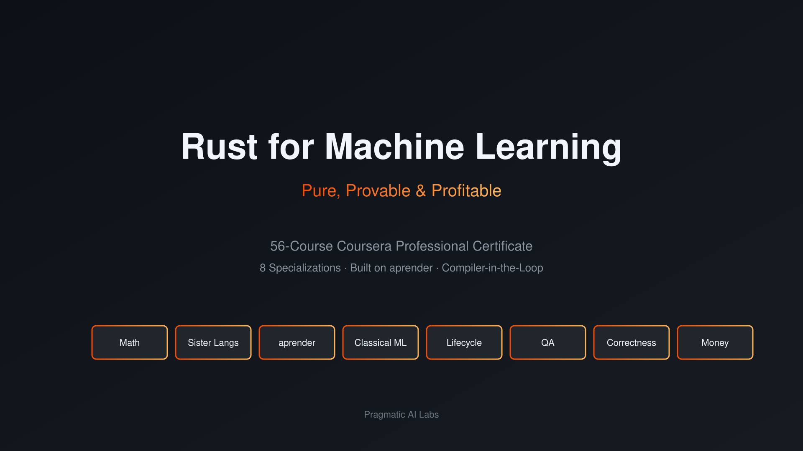

# Rust for Machine Learning

[](https://github.com/paiml/rust-ml-specialization/actions/workflows/ci.yml)
[](./LICENSE)



**Pure, Provable & Profitable Machine Learning in Rust** — a 57-course Coursera Professional
Certificate that takes you from mathematical foundations and polyglot literacy through pure-Rust
classical ML, training, inference, and quantization, into provable correctness via Lean and
contract-based verification, and finally into monetization as an ML engineer.

Built end-to-end on [**aprender**](https://github.com/paiml/aprender) — a 70-crate, 57-command,
25,391-test pure-Rust ML framework — with a **compiler-in-the-loop** thread running through every
track: from depyler/ruchy/bashrs transpilers verified by `rustc`, to LLM codegen self-corrected
by aprender's own inference server, to ML kernels proven correct in Lean.

## Tracks

The certificate stacks as **8 Coursera Specializations** (7 courses each, plus one
cross-cutting systems course in Track 6 — **57 total**):

```text
Math ──► Sister Langs ──► aprender Foundations ──► Classical ML ──►
   (1)        (2)                  (3)                  (4)

Model Lifecycle ──► Inspection & QA ──► Correctness ──► Entrepreneurship
      (5)                 (6)              (7)               (8)
```

| # | Specialization | Builds On | Unlocks |
| --- | --- | --- | --- |
| 1 | Mathematical Foundations | — | Everything |
| 2 | Sister Languages & Transpilers | Math | Polyglot fluency, compiler-in-the-loop |
| 3 | aprender Foundations | Math + Rust | Pure-Rust ML stack |
| 4 | Classical ML in Pure Rust | aprender Foundations | Production classical models |
| 5 | Model Lifecycle: Formats, Training, Inference | Classical ML + aprender | Full LLM lifecycle |
| 6 | Inspection, Profiling & QA | Lifecycle | Production readiness |
| 7 | Correctness: Provable Contracts + Lean | Lean + QA | Compile-time guarantees |
| 8 | Entrepreneurship for ML Engineers | Full stack fluency | Income & ownership |

## Track 1 — Mathematical Foundations

Math first, applied through aprender from day one.

| # | Course | Anchored In | Capstone |
| --- | --- | --- | --- |
| 1 | **Linear Algebra for ML** | aprender tensors, `apr inspect` | TBD |
| 2 | **Calculus & Autodiff** | `aprender-train` internals | TBD |
| 3 | **Traditional Statistics** | `aprender-core` stats modules | TBD |
| 4 | **Probability & Bayesian Inference** | aprender Bayesian module | TBD |
| 5 | **Optimization Theory** | training-loop optimizers | TBD |
| 6 | **Graph Theory for ML** | `aprender-graph` | TBD |
| 7 | **Game Theory for ML** | RL & multi-agent intuition | TBD |

## Track 2 — Sister Languages: The Compiler-in-the-Loop Frame

Each language is a lens on aprender. The throughline: every translation is verified by `rustc` + contracts.

| # | Course | Lens | Capstone |
| --- | --- | --- | --- |
| 8 | **R from Zero (for Rust ML)** | Statistical computing — compare R's `lm()` to aprender `LinearRegression` | TBD |
| 9 | **Julia from Zero (for Rust ML)** | Scientific computing — multiple dispatch vs. traits | TBD |
| 10 | **Lean from Zero (for Rust ML)** | Proof — the bridge to provable contracts | TBD |
| 11 | **depyler: Python → Rust for ML** | The migration on-ramp | TBD |
| 12 | **ruchy: Scripting → Rust** | Ergonomics without leaving the type system | TBD |
| 13 | **bashrs: Type-Safe Shell for ML Ops** | Reproducible pipelines | TBD |
| 14 | **Compiler-in-the-Loop: The Unifying Theory** | Concept + capstone | TBD |

## Track 3 — aprender Foundations

| # | Course | Crate / Command | Capstone |
| --- | --- | --- | --- |
| 15 | **Aprender from Zero** | `aprender`, `apr` | TBD |
| 16 | **The `apr` CLI Surface: 57 Commands** | `apr-cli` | TBD |
| 17 | **Workspace & 70-Crate Monorepo Design** | workspace | TBD |
| 18 | **Your First Local Model** | `apr pull`, `apr run`, `apr chat` | TBD |
| 19 | **SIMD from First Principles** | `aprender-compute` | TBD |
| 20 | **CUDA Kernels & PTX in Rust** | `aprender-gpu`, `apr ptx` | TBD |
| 21 | **CPU/GPU Parity Testing** | `apr parity`, `apr gpu` | TBD |

## Track 4 — Classical ML in Pure Rust

| # | Course | Module | Capstone |
| --- | --- | --- | --- |
| 22 | **Linear & Logistic Regression** | `aprender-core` | TBD |
| 23 | **Decision Trees & Random Forests** | `aprender-core` | TBD |
| 24 | **Gradient Boosting Machines** | `aprender-core` | TBD |
| 25 | **KNN, Naive Bayes & SVM** | `aprender-core` | TBD |
| 26 | **Unsupervised: K-Means, PCA, ICA** | `aprender-core` | TBD |
| 27 | **Time Series: ARIMA & GLMs** | `aprender-core` | TBD |
| 28 | **Graph ML & Bayesian Inference** | `aprender-graph` + Bayesian | TBD |

## Track 5 — Model Lifecycle: Formats, Training, Inference

| # | Course | Tools | Capstone |
| --- | --- | --- | --- |
| 29 | **GGUF, SafeTensors & the Native APR Format** | `apr inspect`, `apr tensors` | TBD |
| 30 | **Quantization: q4_0, q4_k & Beyond** | `apr quantize` | TBD |
| 31 | **Custom Training Loops in Rust** | `aprender-train` | TBD |
| 32 | **LoRA Fine-tuning** | `apr finetune` | TBD |
| 33 | **QLoRA & Knowledge Distillation** | `apr finetune`, `apr distill` | TBD |
| 34 | **Model Merging & Export** | `apr merge`, `apr export`, `apr convert` | TBD |
| 35 | **Production Serving** | `apr serve`, `aprender-serve` | TBD |

## Track 6 — Inspection, Profiling & QA

| # | Course | Tool | Capstone |
| --- | --- | --- | --- |
| 36 | **Model Introspection** | `apr inspect`, `apr tensors`, `apr diff` | TBD |
| 37 | **Validation in Practice** | `apr validate` | TBD |
| 38 | **Roofline Profiling** | `apr profile`, `aprender-profile` | TBD |
| 39 | **Benchmarking & QA Gates** | `apr bench`, `apr qa` | TBD |
| 40 | **TUI & ComputeBrick Monitoring** | `apr tui`, `apr monitor`, `apr cbtop` | TBD |
| 41 | **HuggingFace Hub Integration** | `apr pull`, `apr list`, `apr publish` | TBD |
| 42 | **Text & Audio Processing Pipelines** | `aprender-core` text/audio | TBD |
| 57 | **Network Performance for ML Systems** | `apr serve`, `apr profile`, `netprobe` | Diagnose & tune an ML data path |

## Track 7 — Correctness: Provable Contracts + Lean

The signature ending — deeper than the DE spec's contracts course.

| # | Course | Focus | Capstone |
| --- | --- | --- | --- |
| 43 | **Provable Contracts: The aprender Approach** | `aprender-contracts` | TBD |
| 44 | **Writing Equation-Based YAML Contracts** | `contracts/*.yaml` | TBD |
| 45 | **Falsification Testing for ML Kernels** | proptest + contracts | TBD |
| 46 | **Lean Proofs for aprender Kernels** | Lean ↔ Rust | TBD |
| 47 | **LLM-in-Loop Codegen** | `apr serve` + transpilers | TBD |
| 48 | **Self-Correcting Codegen via Compiler Feedback** | apr + depyler + `rustc` | TBD |
| 49 | **RAG & Agentic Workflows in Pure Rust** | `aprender-rag`, `aprender-orchestrate` | TBD |

## Track 8 — Entrepreneurship for ML Engineers

Most ML curricula stop at "you can build it." This track teaches you to price, package, and sell
it. Every business course uses aprender as the worked example.

| # | Course | Focus | Capstone |
| --- | --- | --- | --- |
| 50 | **Red, Yellow & Green Money for ML Engineers** | The framework | TBD |
| 51 | **Red Money: The Salary Track** | Compensation, leverage, FAANG vs. startup | TBD |
| 52 | **Yellow Money: ML Consulting** | Scoping, pricing days, productizing offers | TBD |
| 53 | **Green Money I — Royalties** | Books, courses, content | TBD |
| 54 | **Green Money II — SaaS on Rust** | From `apr serve` demo to paying customers | TBD |
| 55 | **Pricing, Positioning & Open Source Strategy** | aprender as case study | TBD |
| 56 | **Capstone: Ship a Verified, Monetized aprender System** | End-to-end | TBD |

## Learning Arc

```text
        ┌─────────────────────────────────────────────────────────────┐
        │                  COMPILER-IN-THE-LOOP                       │
        │     rustc + contracts + Lean verify every translation       │
        └─────────────────────────────────────────────────────────────┘
              │           │           │           │           │
              ▼           ▼           ▼           ▼           ▼
   Math ──► Langs ──► aprender ──► Classical ──► Lifecycle ──►
                                                                │
                                                                ▼
                                          QA ──► Correctness ──► Money
```

Every track depends on the math and Rust fluency built in Tracks 1–3. The compiler-in-the-loop
discipline introduced in Track 2 is reinforced in every later track: transpilers in 2, contract
falsification in 6, Lean proofs in 7, and verified SaaS deliverables in 8.

## Foundation Repositories

| Repo | Role | Coverage |
| --- | --- | --- |
| [paiml/aprender](https://github.com/paiml/aprender) | Pure-Rust ML framework (70 crates, 57 `apr` commands, 405 provable contracts, 25,391 tests) | ~80% of course content |
| [paiml/depyler](https://github.com/paiml/depyler) | Python → Rust transpiler (semantic verification) | Track 2, Track 7 |
| [paiml/ruchy](https://github.com/paiml/ruchy) | Scripting language transpiling to Rust | Track 2 |
| [paiml/bashrs](https://github.com/paiml/bashrs) | Rust → Shell transpiler for deterministic ops | Track 2 |

## Structure

Each course is ~60 minutes of 3–5 minute videos organized as:

```text
Course → Module → Lesson (3–5 videos) → Key Terms + Reflection
```

Every module ends with a **Critical Thinking Assessment** (quiz + role-play practice assignment).
Every course ends with a **Capstone Project** — a LinkedIn-shareable portfolio artifact built on
aprender or a sister tool. Courses with low setup overhead also ship **Playground Readings**:
zero-install capstones runnable in the browser at <https://play.rust-lang.org/>.

## Installation

```text
git clone https://github.com/paiml/rust-ml-specialization.git
cd rust-ml-specialization
make check
```

## Usage

```text
make help          # Show available commands
make lint          # Lint markdown files
make test          # Validate course structure (56 courses, 8 tracks, capstone sections)
make check         # Run lint + test
```

## Instructors

* TBD
* TBD
* TBD

## License

Course content copyright Pragmatic AI Labs. Code examples are MIT licensed.
